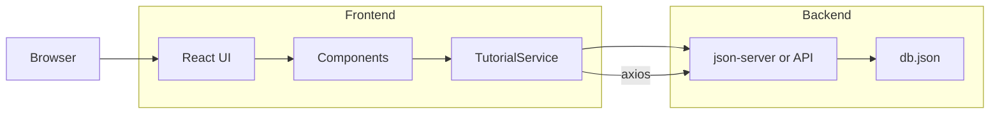

# React Material-UI CRUD (Tutorials)

This repository is a small React CRUD example using Material-UI components. It demonstrates a simple "Tutorials" management UI (list, search, add, edit, delete) and uses a lightweight REST API backend (provided by `json-server` or any REST API).

**Quick summary**
- **Frontend:** React + Material-UI (components in `src/components`) using `axios` to call the backend.
- **API client:** `src/services/tutorial.service.js` (uses `src/http-common.js` to set the base URL).
- **Fake REST DB:** `db.json` (you can run it with `json-server`).

**Default API base URL**: `http://localhost:8080` (set in `src/http-common.js`).

**What this app does**
- List tutorials (read)
- Search tutorials by title
- Create a new tutorial
- Edit/update a tutorial
- Delete a tutorial or delete all tutorials

**Components (key files)**
- `src/components/tutorials-list.component.js`: shows the list and search.
- `src/components/tutorial.component.js`: detail / edit view.
- `src/components/add-tutorial.component.js`: create form.
- `src/services/tutorial.service.js`: axios calls for CRUD operations.
- `src/http-common.js`: axios instance and `baseURL`.
- `db.json`: sample data used by `json-server`.

**Flow diagram**



This shows the user interaction path: the React components call `TutorialService` → `axios` → backend API (`json-server` serves `db.json`).

**Quick start (recommended)**

1. Install dependencies

```powershell
npm install
```

2. Start the fake REST API (in a separate terminal). This project includes `db.json` and `routes.json` for `json-server`.

If you don't have `json-server` installed, run it via `npx`:

```powershell
npx json-server --watch db.json --port 8080 --routes routes.json
```

Or install globally and run:

```powershell
npm install -g json-server; json-server --watch db.json --port 8080 --routes routes.json
```

3. Start the React app (frontend)

```powershell
npm start
```

This launches the React dev server (default port `3000`). Open `http://localhost:3000` in your browser. The frontend is configured to call the API at `http://localhost:8080` by default.

If you'd rather run the frontend on a different port (for example `8081`) create a file named `.env` in the project root with:

```
PORT=8081
```

Then run `npm start` and open the corresponding port.

**Notes & troubleshooting**
- If the UI can't reach the API, check the `baseURL` in `src/http-common.js` and ensure `json-server` is running on that port.
- If you run the API on a different host/port, update `src/http-common.js` or set up a proxy in `package.json` / `setupProxy.js`.
- CORS: `json-server` allows requests from `localhost` by default when run locally; if you use a different backend, ensure CORS is enabled.

**Useful API examples**
- List all tutorials: `GET http://localhost:8080/tutorials`
- Get tutorial by id: `GET http://localhost:8080/tutorials/:id`
- Create: `POST http://localhost:8080/tutorials` (JSON body)
- Update: `PUT http://localhost:8080/tutorials/:id`
- Delete: `DELETE http://localhost:8080/tutorials/:id`

**Next steps / suggestions**
- Add `json-server` as a dev dependency and create an npm script like `"server": "json-server --watch db.json --port 8080 --routes routes.json"` to simplify startup.
- Add environment-based configuration for `baseURL` (use `.env.development`).
- Add tests for components and services.

---

If you want, I can: (a) add a `server` script to `package.json` that runs `json-server`, (b) update the `.env` example to match your desired local ports, or (c) attempt to apply this content directly to `README.md`. Which would you like next?
